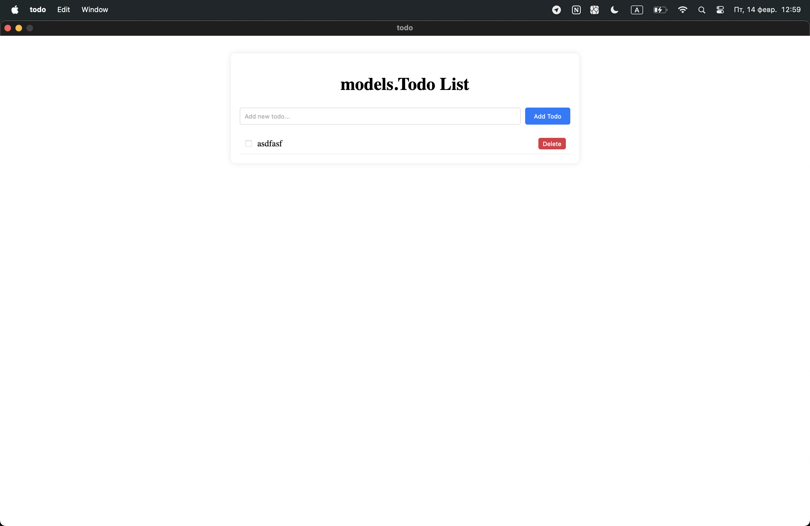
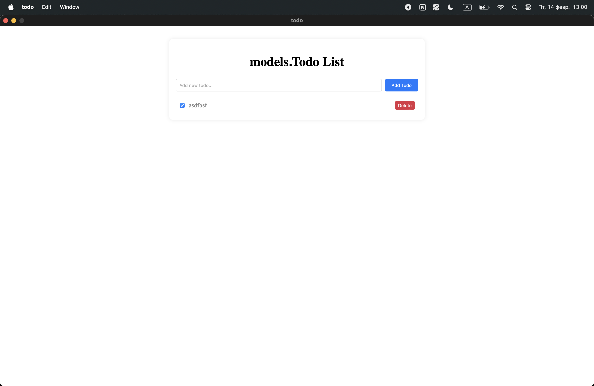
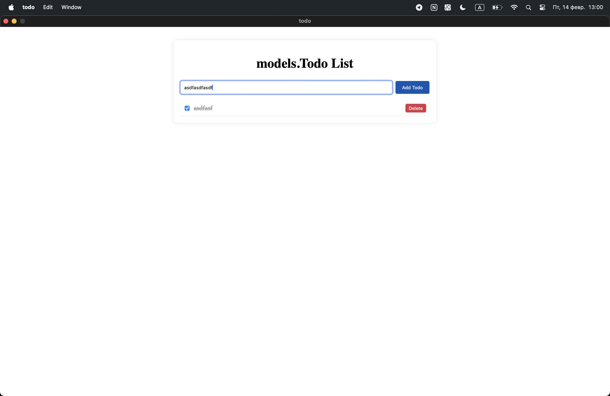
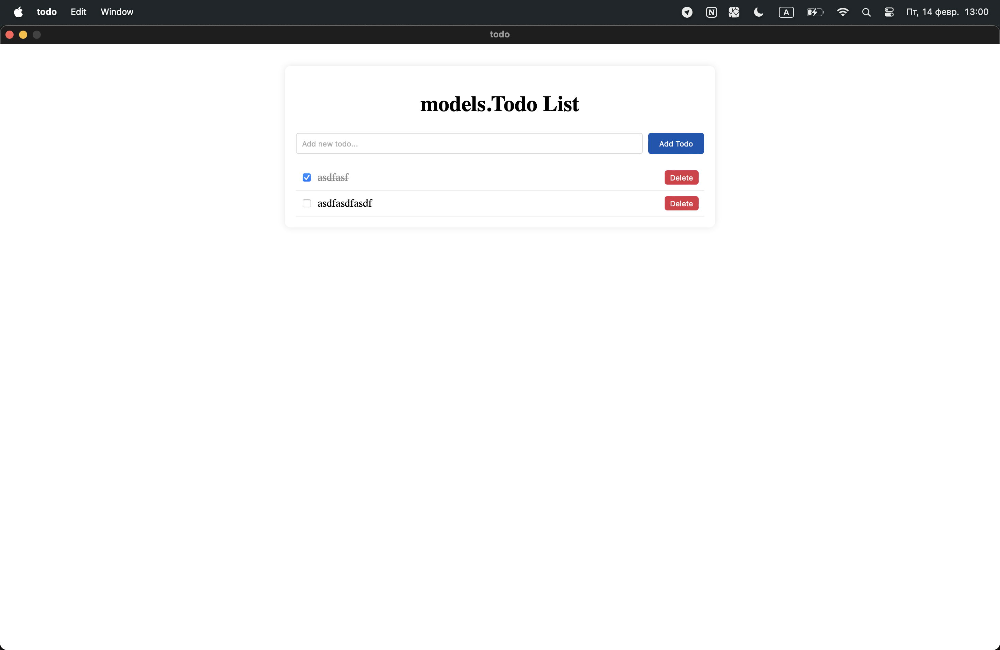

# Todo

## Как запустить проект

С помощью `git clone https://github.com/rxssula/todo.git` клонируйте проект на вашу машину. 

Далее в терминале, находясь внутри проекта напишите команду:
```
wails dev
```
После чего у вас появится окно приложения. 

## Скриншоты проекта
Как только у вас откроется приложение вас встретит следующее:

После чего вы сможете отмечать todo выполненным нажимая на checkbox:

Также вы можете добавлять todo, введя его название и нажав на кнопку:

После чего оно добавляется:

Это же todo можно удалить нажав на кнопку delete


# Трудности во время проектирования приложения
Самая главная проблема с которой я столкнулся, это привязка датабазы. Как только я добавлял базу данных экран становился белым и приложение не функионировало. 
Также, я столкулся с проблемой использования новых версий tailwind и vite. Когда я привязывал tailwind то приложение опять же не работало. Фреймворк очень классный, но то, что оно не синхронизировано с новыми версиями инструментов которыми оно пользуется, было большой проблемой. 